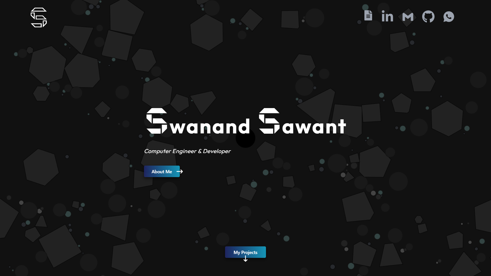

# Portfolio
This repository contains the source code for my personal portfolio website. The website showcases my skills, projects, and professional journey. It's designed to provide visitors with insights into my work and capabilities, serving as an online resume and a platform to connect with me.

## Live Demo
A live demo of the application is hosted at [https://sawantswanand.vercel.app](https://sawantswanand.vercel.app)


## Built With
- [React](https://reactjs.org/) - A JavaScript library for building user interfaces.
- [Tailwind CSS](https://tailwindcss.com/) - A utility-first CSS framework for creating custom designs.
- [Framer Motion](https://www.framer.com/motion/) - A powerful animation library for React that provides smooth and interactive animations.

## Run Locally
To run this project locally, follow these steps:

1. Clone the repository:
   ```bash
   git clone [https://github.com/Swanand12/Chat-App.git](https://github.com/Swanand12/Portfolio.git)

2. Install dependencies:
   ```bash
   npm install

3. Run the App:
   ```bash
   npm start

## Matter.js Animation Guide

#### Step 1: Install dependencies
   ```bash
   npm install matter-js
   npm install jquery
```

#### Step 2: Create a matter.js file and add animation code 
[Animation Code](src/particles/matter.js)

#### Step 3: Add Matter.js file component to App.js
```html
<MatterCanvas/>
```
   
